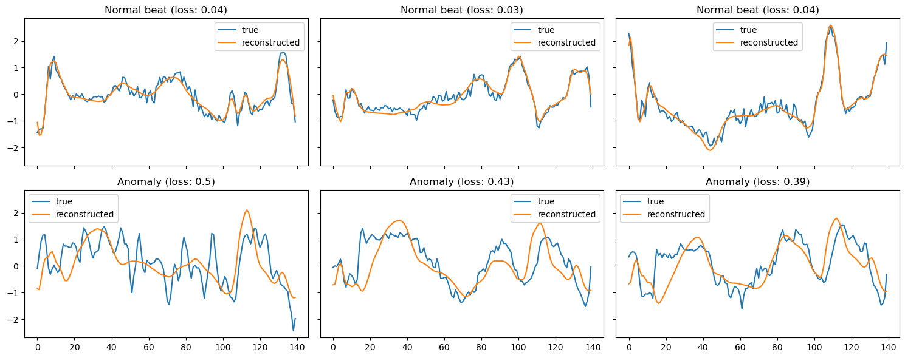
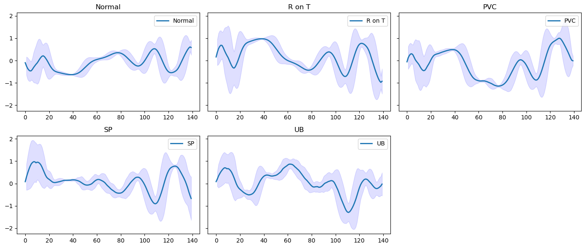
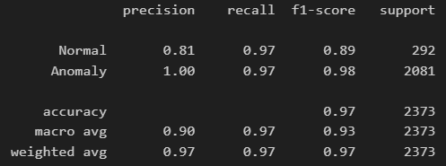

# Anomaly Detection in ECG Data using LSTM Autoencoder

This project focuses on detecting anomalies in ECG (Electrocardiogram) data using a Long Short-Term Memory (LSTM) Autoencoder. The goal is to identify abnormal heartbeats (anomalies) by reconstructing normal ECG signals and detecting deviations from the learned patterns.

## Dataset

The dataset consists of 5,000 ECG signals from the [ECG5000 dataset](http://www.timeseriesclassification.com/description.php?Dataset=ECG5000), which contains labeled ECG signals., each with 140 time steps. The signals are labeled into five classes:

* **Normal** : Class `1`
* **R on T** : Class `2`
* **PVC** : Class `3`
* **SP** : Class `4`
* **UB** : Class `5`

The dataset is split into:

* **Training set** : Normal ECG signals only (used for training the autoencoder).
* **Validation set** : Normal ECG signals (used for tuning the model).
* **Test set** : Normal and anomalous ECG signals (used for evaluation).

## Methodology

### Data Preprocessing

1. **Normalization** : The ECG signals are normalized using `StandardScaler` to ensure consistent scaling

   

### Model Architecture

The autoencoder consists of:

* **Encoder** : Two LSTM layers to compress the input sequence into a lower-dimensional representation.
* **Decoder** : One LSTM layer to reconstruct the original sequence from the compressed representation.

### Training

The model is trained for 100 epochs using the Mean Squared Error (MSE) loss function and optimized using the Adam optimizer.
Learning rate is set to 1e-4 and batch size is 8.

### Anomaly Detection

Anomalies are detected by comparing the reconstruction error of a signal to a predefined threshold (0.3). If the error exceeds the threshold, the signal is classified as an anomaly.

## Results

### Training Loss

The model achieves a training loss of **11.61** and a validation loss of **8.75** after 100 epochs.

### Confusion Matrix

The confusion matrix shows the performance of the model on the test set:

|                   | Predicted Normal | Predicted Anomaly |
| ----------------- | ---------------- | ----------------- |
| **Normal**  | 97.26%           | 2.74%             |
| **Anomaly** | 3.12%            | 96.88%            |

### Example Reconstructions

* **Normal beats** : The model accurately reconstructs normal ECG signals with low reconstruction error.
* **Anomalies** : The model struggles to reconstruct anomalous signals, resulting in high reconstruction error.
  This demonstrates the effectiveness of LSTM autoencoders for anomaly detection in ECG data.
